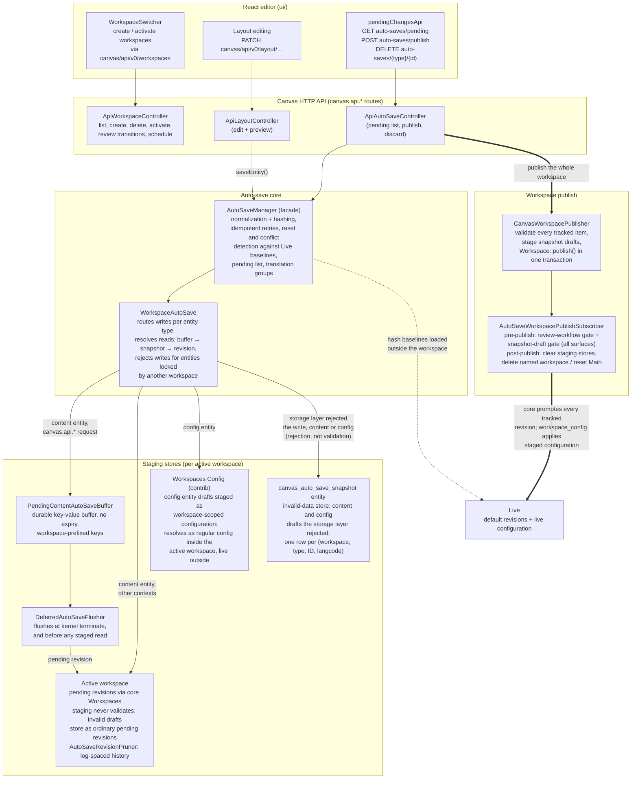

# Workspace-staged auto-save architecture

High-level view of how Canvas stages auto-saves in Drupal core Workspaces
(see [ADR 0017](../adr/0017-full-workspaces-integration.md), which supersedes
the publish half of [ADR 0014](../adr/0014-stage-autosaves-in-a-dedicated-workspace.md)).
Staging follows the negotiated active workspace: content drafts become
pending revisions and config drafts become workspace-scoped configuration
(via the contrib Workspaces Config module) in whichever workspace is active.
The Main workspace (`canvas_default`) is the permanent default the editor
activates when negotiation yields none; named workspaces are parallel units
of work. The workspace — not the item — is the unit of review and publish:
`CanvasWorkspacePublisher` validates every tracked item up front, stages any
snapshot-held drafts, and calls core `Workspace::publish()` in one database
transaction.

Invariant: for any target entity (per type, ID, langcode, and workspace),
exactly one staging store holds the current draft. Every staging key is
workspace-prefixed (`{workspace}:{type}:{id}[:{langcode}]`), and snapshot
rows carry a workspace column. Reads resolve in the order pending buffer,
then snapshot row, then the primary store: workspace revision for content,
workspace-scoped configuration for config. A successful persist to a
primary store deletes the shadowing snapshot row.

Invalid is not the same as unstorable. Staging never runs entity validation,
so a draft that would fail validation stores in its primary store like any
other draft; the snapshot fallback exists only for drafts the storage layer
refuses to write. Validation runs once, at publish, over every item tracked
in the workspace — and any invalid item aborts the whole publish (all or
nothing).

Publishing completes a workspace: core promotes every tracked revision
(sibling translations and dependent path aliases included), the
`workspace_config` pre-publish subscriber applies staged configuration, and
the post-publish subscriber clears every Canvas staging store for the
workspace — then deletes a named workspace (its content is live) or resets
the Main workspace's review state and schedule. Publishes from any surface
(Canvas API, core Workspaces UI, cron) pass the same pre-publish gates: a
review-required workspace must sit in an approved-for-publishing workflow
state, and a workspace with snapshot-held drafts can only be published by
the Canvas publisher, which stages them first. Discard clears staging per
translation group, and dependent staged entities such as URL aliases follow
their host through both.
