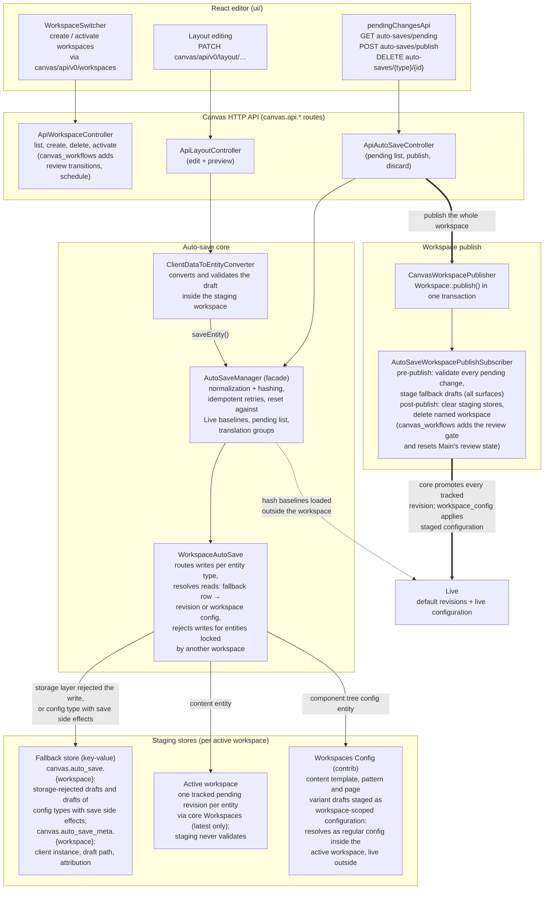

# Workspace-staged auto-save architecture

High-level view of how Canvas stages auto-saves in Drupal core Workspaces
(see [ADR 0017](../adr/0017-full-workspaces-integration.md), which supersedes
the publish half of [ADR 0014](../adr/0014-stage-autosaves-in-a-dedicated-workspace.md)).
Staging follows the negotiated active workspace: a staged write is an entity
save inside that workspace. Content drafts become pending revisions and
component tree config drafts become workspace-scoped configuration (via the
contrib Workspaces Config module). The Main workspace (`canvas_default`) is
the permanent default the editor activates when negotiation yields none;
named workspaces are parallel units of work. The workspace — not the item —
is the unit of review and publish: `CanvasWorkspacePublisher` calls core
`Workspace::publish()` in one database transaction, and Canvas's pre-publish
subscriber validates every pending change and stages the fallback drafts
before core promotes anything.

Invariant: for any target entity (per type, ID, langcode, and workspace),
exactly one staging store holds the current draft. Auto-save keys are
workspace-prefixed (`{workspace}:{type}:{id}[:{langcode}]`); the key-value
stores are one collection per workspace. Reads resolve a fallback row first,
then the primary store: the one tracked workspace revision for content
(loaded by revision id), workspace-scoped configuration for config. A
successful persist to a primary store deletes the shadowing fallback row.

Invalid is not the same as unstorable. Staging never runs entity validation,
so a draft that would fail validation stores in its primary store like any
other draft; the fallback store exists for drafts the storage layer refuses
to write, and for config entity types whose save has side effects (code
components, asset libraries, brand kits, staged config updates, staged
configuration translations). Validation runs once, at publish, over every
pending change of the workspace — and any invalid item aborts the whole
publish (all or nothing).

```mermaid
flowchart TB
    subgraph UI["React editor (ui/)"]
        switcher["WorkspaceSwitcher<br>create / activate workspaces<br>via canvas/api/v0/workspaces"]
        layoutApi["Layout editing<br>PATCH canvas/api/v0/layout/…"]
        pendingApi["pendingChangesApi<br>GET auto-saves/pending<br>POST auto-saves/publish<br>DELETE auto-saves/{type}/{id}"]
    end

    subgraph HTTP["Canvas HTTP API (canvas.api.* routes)"]
        wsCtl["ApiWorkspaceController<br>list, create, delete, activate<br>(canvas_workflows adds<br>review transitions, schedule)"]
        layoutCtl["ApiLayoutController<br>(edit + preview)"]
        autoSaveCtl["ApiAutoSaveController<br>(pending list, publish, discard)"]
    end

    subgraph Core["Auto-save core"]
        converter["ClientDataToEntityConverter<br>converts and validates the draft<br>inside the staging workspace"]
        asm["AutoSaveManager (facade)<br>normalization + hashing,<br>idempotent retries, reset against<br>Live baselines, pending list,<br>translation groups"]
        wsa["WorkspaceAutoSave<br>routes writes per entity type,<br>resolves reads: fallback row →<br>revision or workspace config,<br>rejects writes for entities locked<br>by another workspace"]
    end

    subgraph Staging["Staging stores (per active workspace)"]
        fallback["Fallback store (key-value)<br>canvas.auto_save.{workspace}:<br>storage-rejected drafts and drafts of<br>config types with save side effects;<br>canvas.auto_save_meta.{workspace}:<br>client instance, draft path, attribution"]
        ws["Active workspace<br>one tracked pending revision per entity<br>via core Workspaces (latest only);<br>staging never validates"]
        wsconfig["Workspaces Config (contrib)<br>content template, pattern and page<br>variant drafts staged as<br>workspace-scoped configuration:<br>resolves as regular config inside the<br>active workspace, live outside"]
    end

    subgraph Publish["Workspace publish"]
        publisher["CanvasWorkspacePublisher<br>Workspace::publish() in one transaction"]
        gate["AutoSaveWorkspacePublishSubscriber<br>pre-publish: validate every pending change,<br>stage fallback drafts (all surfaces)<br>post-publish: clear staging stores,<br>delete named workspace<br>(canvas_workflows adds the review gate<br>and resets Main's review state)"]
    end

    live["Live<br>default revisions + live configuration"]

    switcher --> wsCtl
    layoutApi --> layoutCtl
    pendingApi --> autoSaveCtl
    layoutCtl --> converter
    converter -- "saveEntity()" --> asm
    autoSaveCtl --> asm
    asm --> wsa
    wsa -- "content entity" --> ws
    wsa -- "component tree config entity" --> wsconfig
    wsa -- "storage layer rejected the write,<br>or config type with save side effects" --> fallback
    autoSaveCtl == "publish the whole workspace" ==> publisher
    publisher --> gate
    gate == "core promotes every tracked<br>revision; workspace_config applies<br>staged configuration" ==> live
    asm -. "hash baselines loaded<br>outside the workspace" .-> live
```

Publishing completes a workspace: Canvas's pre-publish subscriber validates
every pending change and stages the fallback drafts, core promotes every
tracked revision (sibling translations and dependent path aliases included),
the `workspace_config` pre-publish subscriber applies staged configuration,
and the post-publish subscriber clears every Canvas staging store for the
workspace — then deletes a named workspace (its content is live); the Main
workspace is permanent. Publishes from any surface (Canvas API, core
Workspaces UI, cron) pass the same pre-publish gates: Canvas's validation,
and — with the optional `canvas_workflows` sub-module — a review-required
workspace must sit in an approved-for-publishing workflow state. Discard
clears staging per translation group, and dependent staged entities such as
URL aliases follow their host through both.

Core's `EntityWorkspaceConflict` lock applies as is: an entity with a draft
in one workspace cannot be saved outside that workspace until the draft is
published or discarded. Canvas therefore converts and validates every draft
inside the staging workspace, and has no external-edit conflict detection of
its own.
